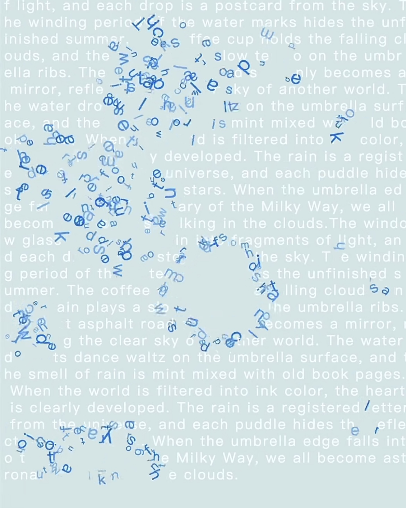
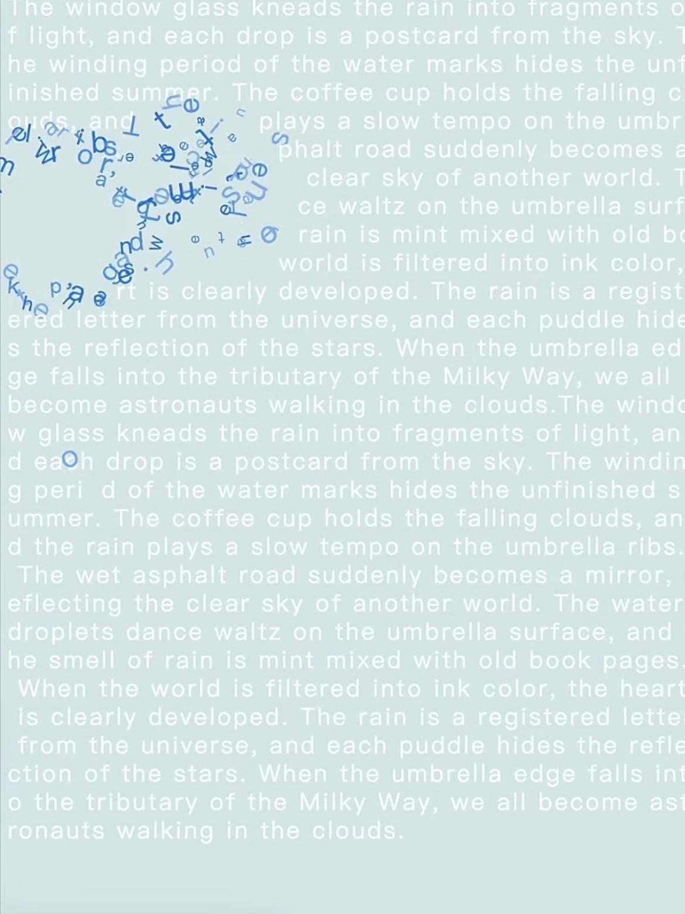
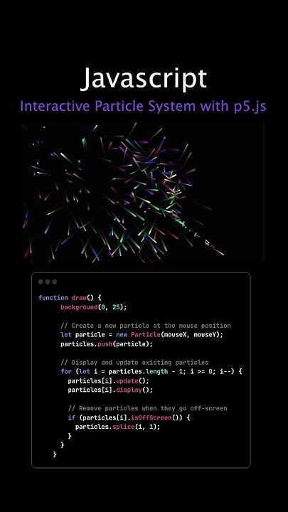

## Part 1: Imaging Technique Inspiration

I was inspired by the “text particle explosion” effect from kinetic typography and motion graphics in films. The transition from orderly text to dispersed flying fragments creates a powerful visual impact. I would like to incorporate this technique because it conveys transformation and energy, which aligns well with the assignment’s goal of exploring dynamic visual effects. Even if challenging, it offers strong inspiration for combining typography with motion.

### Example Screenshots:

## Part 2: Coding Technique Exploration

To achieve this, I would apply p5.js vector-based techniques. Using p5.Vector methods (.add(), .normalize(), .mult()) lets each letter act as a particle influenced by velocity and acceleration. Functions like random() introduce variation, while map() controls explosion strength by distance, and alpha blending produces smooth trails. This coding technique gives precise control over dispersal direction and decay, making the explosion visually engaging and aligned with the chosen imaging effect.

Link: https://p5js.org/examples/math-and-physics-smoke-particle-system/?utm_source=chatgpt.com
